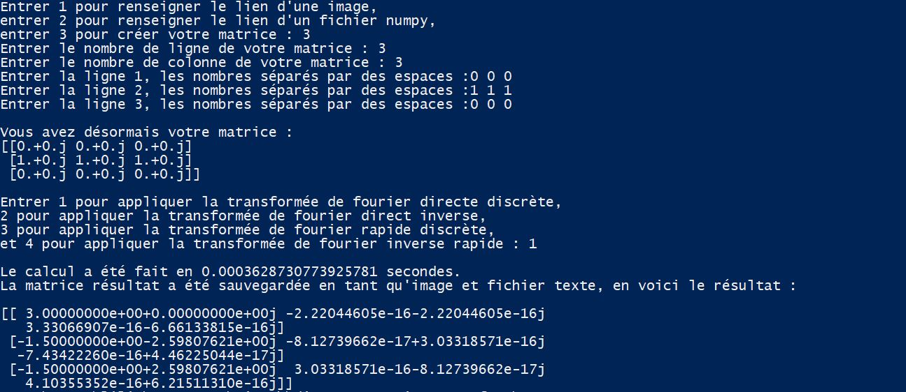

# Project

It's a small program with functions to calculate discrete Fourier transforms and inverse discrete fourier transform with different algorithms (DFT, FFT, IDFT, IFFT).



This project was made for a 3rd year license study project.


### Features 

- Before using functions you can import image, import a file Numpy (with extension .npy), or create matrix.
- You can choose between 4 functions to applied :
  - calcul of discrete Fourier transform with direct algorithm (DFT)
  - calcul of inverse discrete Fourier transform with direct algorithm (IDFT)
  - calcul of discrete Fourier transform with recursive algorithm (FFT)
  - calcul of inverse discrete Fourier transform with recursive algorithm (IFFT)
- After the function has been applied, my program create result image and some result file in different file format.

# Built with 

The project was made in Python with 4 Python modules (PIL, cmath, numpy, time).

# Get and use project

### Prerequisites

1. You need [Python](https://www.python.org/downloads/ "").
2. You need install the 4 Python modules : PIL, cmath, numpy, time.
```
python -m pip install name_module
```

### Installation 

1. Clone the repo. 
```
git clone https://github.com/LilianLeVrai/discrete_Fourier_transform.git
```
2. And just run the program. 
```
python src/main.py
```

# Documentation

You can find a report about this project in the 'docs' folder. 
This project being intended for a French professor, this report and the comments of the code are in French.

# Contributor 

- [Lilian M.](https://github.com/LilianLeVrai "")


